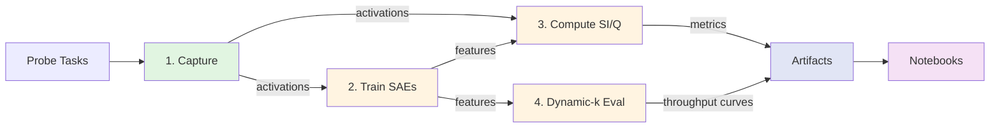

# Solution Architecture (Living Document)

**Last Updated:** October 26, 2025  
**Status:** Phase 1 (Measurement) — 40% complete

---

## Pipeline Overview



**Legend:**  
🟢 Working | 🟡 Stub | 🔴 Blocked

---

## Core Components

### 1. Activation Capture 🟢
**Tool:** `sdlms.cli.sparsity`  
**Status:** Production-ready with streaming + hooks

**Purpose:** Collect FFN activations across probe tasks, measure baseline sparsity (AS).

**Input:**
- Model checkpoint (HF Hub)
- Probe dataset (text corpus or task manifest)
- Layer selection (automatic or manual)

**Output:**
```
artifacts/YYYYMMDD_HHMMSS/
  sparsity.csv              # layer, frac, pr
  meta.jsonl                # config + runtime stats
  acts_<task>_<layer>.npy   # raw activations (future)
```

**Key Decisions:**
- Streaming to avoid OOM (tokenize → forward → hook → save)
- Per-layer `RunningActivationStats` for memory efficiency
- Threshold = 0.0 (count all positive activations)

**Next:** Integrate `data/probe_tasks.jsonl` for multi-task capture

---

### 2. SAE Training 🟡
**Tool:** `sdlms.cli.sae_train` (stub)  
**Status:** Placeholder — needs `sae-lens` integration

**Purpose:** Learn sparse, interpretable features from captured activations.

**Input:**
- Activations from step 1 (`acts_<task>_<layer>.npy`)
- Hyperparameters: L1 coefficient, expansion factor, learning rate

**Output:**
```
artifacts/YYYYMMDD/sae/layer_<name>/
  sae_weights.pt            # encoder/decoder weights
  config.json               # hyperparams + training metadata
  reconstruction_loss.csv   # train/val loss curves
```

**Key Decisions:**
- Use `sae-lens` library (already in dependencies)
- 80/20 train/val split for L1 hyperparameter search
- Dictionary size = 8× hidden_dim (configurable)
- Early stopping on validation reconstruction loss

**Blockers:**
- API integration with `sae-lens.LanguageModelSAERunnerConfig`
- Activation format standardization (NPY vs HDF5)

---

### 3. Specialization & Modularity 🟡
**Tool:** `sdlms.cli.si_modularity` (stub)  
**Status:** Core functions exist (`metrics.py`), CLI wiring needed

**Purpose:** Measure neuron specialization (SI) and community structure (Q).

**Input:**
- Multi-task activations from step 1
- SAE features from step 2 (optional — can run on raw activations)

**Output:**
```
artifacts/YYYYMMDD/si_modularity.csv
# layer, task, SI, Q, n_communities
```

**Algorithm:**
1. Compute per-neuron task probabilities: `P(task | neuron > threshold)`
2. Calculate entropy-based SI: `1 - H(P) / log(K)`
3. Build co-activation graph from PMI
4. Detect communities, compute modularity Q

**Key Decisions:**
- Task probe diversity matters (6+ tasks recommended)
- SI requires ≥500 samples per task for stable estimates
- Q uses top-200 PMI edges to avoid noise

---

### 4. Dynamic-k Efficiency 🟡
**Tool:** `sdlms.cli.dynamic_k` (stub)  
**Status:** `topk_gate()` helper exists, needs eval harness

**Purpose:** Exploit sparsity for FLOPs reduction via selective neuron execution.

**Input:**
- Model checkpoint
- Validation dataset (WikiText-103)
- k sweep: [0.1, 0.2, 0.3, 0.5, 0.7, 1.0]

**Output:**
```
artifacts/YYYYMMDD/dynamic_k.csv
# k, perplexity, tokens_per_sec, flops_reduction, quality_delta
```

**Algorithm:**
1. Monkey-patch MLP forward: `output *= topk_gate(pre_activation, k)`
2. Profile throughput with `torch.cuda.synchronize()` timing
3. Compute perplexity on fixed validation set
4. Repeat for 3 seeds, report mean ± std

**Key Decisions:**
- Static gating first (learned gating = future work)
- Profile on CUDA only (CPU/MPS don't optimize sparsity)
- Baseline (k=1.0) must match unmodified model within 0.01 perplexity

---

## Data Flow & Artifacts

### Directory Structure
```
data/
  probe_tasks.jsonl         # Task manifest (TODO)

artifacts/
  20251026_143022/          # Timestamped run
    sparsity.csv
    si_modularity.csv
    dynamic_k.csv
    meta.jsonl
    sae/
      layer_10/
        sae_weights.pt
        config.json
    acts/                   # Optional: cached activations
      python_code_layer10.npy
      math_layer10.npy
```

### Artifact Guarantees
- **Immutable:** Never overwrite timestamped runs
- **Self-describing:** Every dir has `meta.jsonl` with config
- **Reproducible:** Seed + model hash + dataset split logged

---

## Scaling Suite Configuration

**Models:** Pythia-deduped family (consistent training data)
- pythia-70m, pythia-410m, pythia-1.4b, pythia-6.9b

**Layer Selection:** Relative depth to enable cross-model comparison
```python
LAYERS = {
    "pythia-70m": [2, 3, 5],       # 6 layers total
    "pythia-410m": [6, 12, 18],    # 24 layers
    "pythia-1.4b": [6, 12, 18],    # 24 layers
    "pythia-6.9b": [8, 16, 24],    # 32 layers
}
```

**Probe Tasks (Proposed):**
- python_code (HumanEval)
- math (GSM8K)
- qa (SQuAD)
- prose (WikiText)
- dialogue (DailyDialog)
- reasoning (ARC-Challenge)

---

## Testing & CI

**Principles:**
- CLI smoke tests with tiny models (no GPU required)
- Determinism tests: same seed → same output
- No recomputation in notebooks (read-only artifact loading)

**Current:**
- ✅ Lint + import checks in CI
- ⚠️ Need: `test_cli_determinism.py`, `test_metrics.py`

**Future:**
- Integration test: full pipeline on pythia-70m (1 layer, 100 samples)
- Regression test: AS/SI values on frozen fixtures

---

## Open Decisions

### 1. Activation Storage Format
**Options:** NPY (simple), HDF5 (chunked), HF Datasets (versioned)  
**Current:** NPY for simplicity  
**Revisit if:** Captures exceed 10GB per layer

### 2. Hyperparameter Management
**Options:** CLI args (current), Hydra configs, WandB sweeps  
**Current:** CLI args  
**Revisit when:** Running L1 sweeps across 4 models × 3 layers

### 3. Dynamic-k Implementation
**Options:** Static gating (current plan), learned router, MoE-style top-k  
**Current:** Static (topk on magnitude)  
**Revisit if:** Static gives <20% speedup

### 4. Compute Environment
**Current:** Local (MPS/CUDA)  
**Scale-up options:** Cloud (Lambda Labs), cluster (Slurm), notebooks (Kaggle)  
**Trigger:** When pythia-6.9b captures take >2 hours

---

## Evolution Notes

**Week 1 (Oct 26):** Baseline architecture documented; sparsity CLI working  
**Week 2 (Nov 2):** [TBD] SAE training + task probes integrated  
**Week 3 (Nov 9):** [TBD] SI/Q + dynamic-k pipelines complete  
**Week 4 (Nov 16):** [TBD] Full scaling sweep on 4 model sizes  
**Week 5 (Nov 23):** [TBD] Notebooks + figures finalized

---

*This document evolves with the project. Update after major architectural changes.*

## Compute Planning

- **Local (Mac, CPU/MPS):** good for CLI smoke tests and notebooks with tiny models (hf-internal tiny GPT2). Expect >10 minutes for even a single Pythia-70M pass; avoid large SAE training locally.
- **Single GPU (A100 80GB or similar):** required for activation capture and SAE training on Pythia 70M–1B. Allocate ~8–12 GPU hours per layer for SAE sweeps; dynamic-k profiling also lives here.
- **Multi-GPU / Cluster:** needed once scaling to multiple sizes (410M–2.8B+) and layers concurrently. Request at least 2×A100 (or H100) to parallelize capture + SAE, with >1 TB SSD scratch for activation dumps.
- Workflow: validate locally (tiny runs), run 70M layer on single GPU, then schedule scaling sweeps on cluster.
