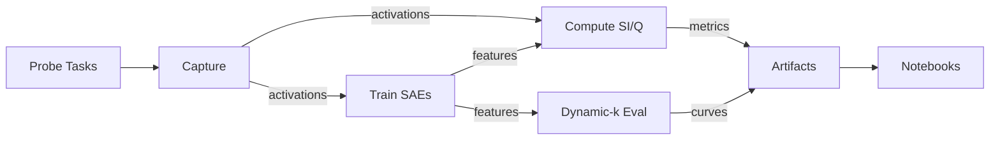

# Solution Architecture

## Pipeline



**Status:** Capture working, SAE/SI/dynamic-k are stubs.

---

## Components

### 1. Capture (✅ `sdlms.cli.sparsity`)
Collect FFN activations, measure activation sparsity (AS).

**Outputs:** `artifacts/YYYYMMDD/sparsity.csv`, `meta.jsonl`

**TODO:** Wire `data/probe_tasks.jsonl` for multi-task capture.

---

### 2. SAE Training (⚠️ `sdlms.cli.sae_train`)
Train sparse autoencoders via `sae-lens`.

**Outputs:** `artifacts/YYYYMMDD/sae/layer_X/{sae_weights.pt, config.json}`

**Blockers:** API integration, activation format (NPY vs HDF5).

---

### 3. SI/Modularity (⚠️ `sdlms.cli.si_modularity`)
Compute specialization index (SI) and graph modularity (Q).

**Inputs:** Multi-task activations + optional SAE features.

**Outputs:** `artifacts/YYYYMMDD/si_modularity.csv`

---

### 4. Dynamic-k (⚠️ `sdlms.cli.dynamic_k`)
Profile throughput vs perplexity with sparse execution.

**Outputs:** `artifacts/YYYYMMDD/dynamic_k.csv` (k, ppl, tokens/sec)

**Approach:** Monkey-patch MLP forward with `topk_gate()`.

---

## Artifacts

```
artifacts/YYYYMMDD/
  sparsity.csv
  si_modularity.csv
  dynamic_k.csv
  meta.jsonl
  sae/layer_X/{weights, config}
  acts/task_X_layer_Y.npy  # optional cache
```

**Rules:** Timestamped runs, never overwrite, include seed+model hash in metadata.

---

## Scaling Suite

**Models:** Pythia 70M/410M/1.4B/6.9B (consistent training data)

**Layers:** Probe at 25%/50%/75% depth for cross-model comparability.

**Tasks:** Code, math, QA, prose, dialogue, reasoning (6 domains).

---

## Open Decisions

1. **Activation format:** NPY now, HDF5 if >10GB/layer.
2. **Hyperparameter sweeps:** CLI args now, Hydra if L1 sweeps get complex.
3. **Dynamic-k:** Static gating first, learned router if <20% speedup.

---

*Update after major changes to pipeline or blockers.*

## Compute Planning

- **Local (Mac, CPU/MPS):** good for CLI smoke tests and notebooks with tiny models (hf-internal tiny GPT2). Expect >10 minutes for even a single Pythia-70M pass; avoid large SAE training locally.
- **Single GPU (A100 80GB or similar):** required for activation capture and SAE training on Pythia 70M–1B. Allocate ~8–12 GPU hours per layer for SAE sweeps; dynamic-k profiling also lives here.
- **Multi-GPU / Cluster:** needed once scaling to multiple sizes (410M–2.8B+) and layers concurrently. Request at least 2×A100 (or H100) to parallelize capture + SAE, with >1 TB SSD scratch for activation dumps.
- Workflow: validate locally (tiny runs), run 70M layer on single GPU, then schedule scaling sweeps on cluster.
